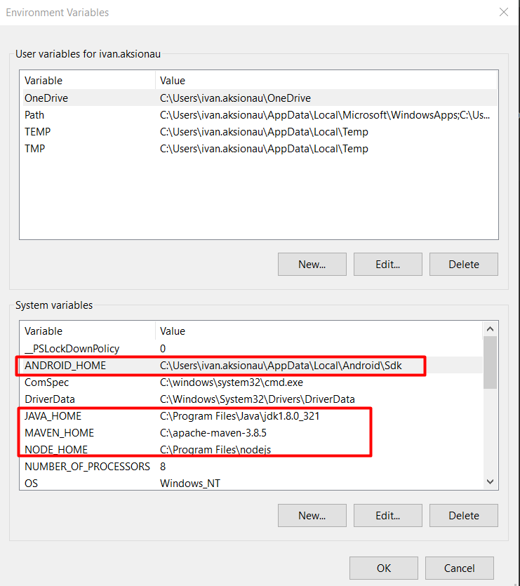
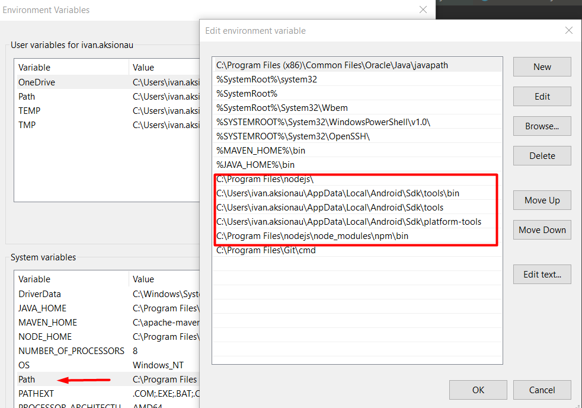

Appium basics for Android AP

Preconditions:
- Download/install Java and set env variables
- Download/install Android Studio and find out the Android SDK path
- Download/install Node(to install Appium server, as Appium server is written on Node)
- Set Java, Android SDK and Node Home Paths in Windows system
     
- Install and start Appium server via node (run in cmd "npm install appium")

Commands list:
- appium - it will start appium server
- appium --allow-insecure chromedriver_autodownload - it will start appium server and download appropriate version of crome driver
- npm install appium --chromedriver_version="91"  -  so you can install specific crome driver version
- UIAutomatorViewer - will start tool to search APP elements location